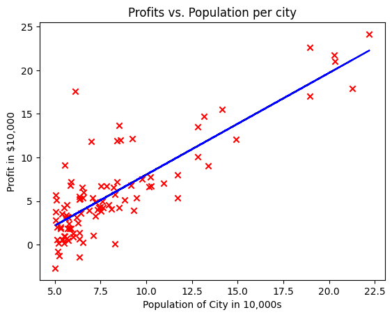

# Linear Regression with One Variable

This project implements linear regression with one variable to predict profits for a restaurant franchise based on the advertising budget. The dataset consists of input features (e.g., advertising budget in $1000s) and corresponding target values (e.g., profits in $1000s).

## Project Overview

### Features
- **Linear Regression**: We implement a linear model to predict profits based on a single feature (advertising budget).
- **Cost Function**: The cost function is calculated to evaluate the performance of the linear model.
- **Gradient Descent**: This algorithm optimizes the parameters by minimizing the cost function.

## Graphs

### 1. Scatter plot of the Training Data


### 2. Linear Regression Fit



## How to Run

1. Clone the repository.
2. Install necessary dependencies:
   ```bash
   pip install numpy matplotlib
